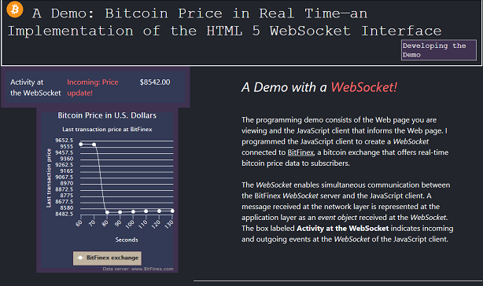

# A Demo: Bitcoin Price in Real Time—an Implementation of the HTML 5 WebSocket Interface 
## A Demo with a <em font-size="14" style= "color:#ff6666;"><b>WebSocket!</b></em> :blush:
##### Beta Version 1.0
 
## Introduction to the Demo
The demo was built to show proficiency in software development. The sections that follow describe the
functionality, source code files, and script dependencies of the demo.   

## Functionality
 The demo consists of a JavaScript client and a Web page. As shown in the graphic that follows, the JavaScript
 client gets real-time bitcoin prices from a WebSocket server and displays the prices in a chart.  

## Source Code Files
Following are the source code files of the demo:

* js-client-socket.js: Contains the source code of the JavaScript client.

* css/maincss.css: Contains the Cascading Style Sheets, level 3 (CSS3) code to style the Web page.

* index.html: Contains the HTML code of the Web page.

## Script Dependencies
The JavaScript client requires the following scripts to run:

* highcharts.js: The JavaScript client uses the  [Highcharts API]('https://www.highcharts.com/') to
    create the chart on the Web page.

* jquery-3.2.1.js: The JavaScript client uses the JQuery *ready* event to begin script execution.

An external reference to each script is included in the index.html file.

